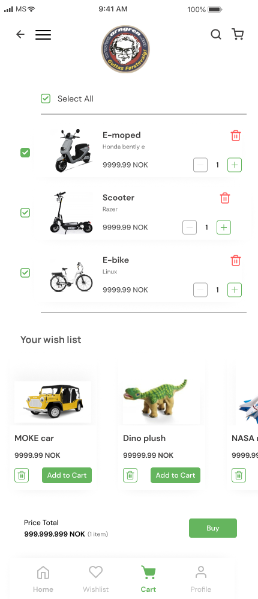
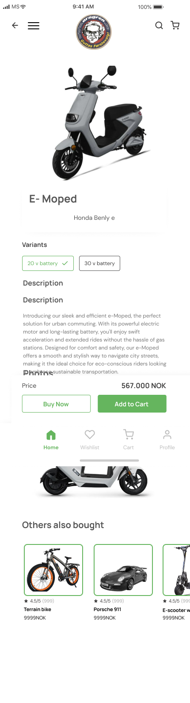
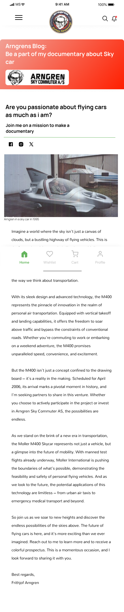
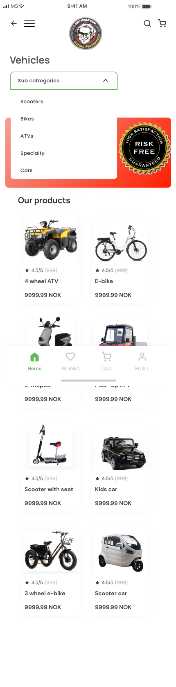
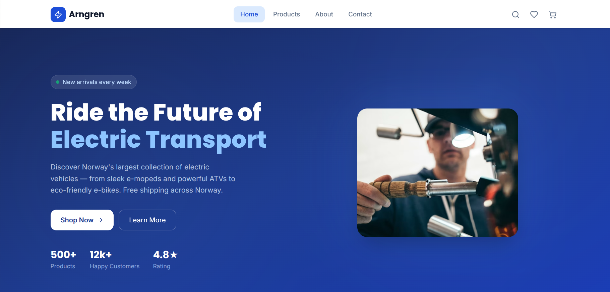
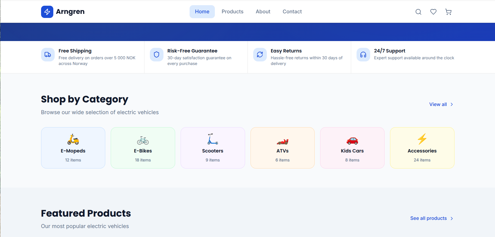
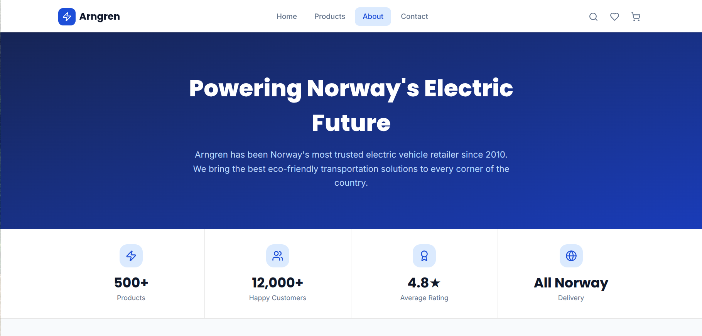
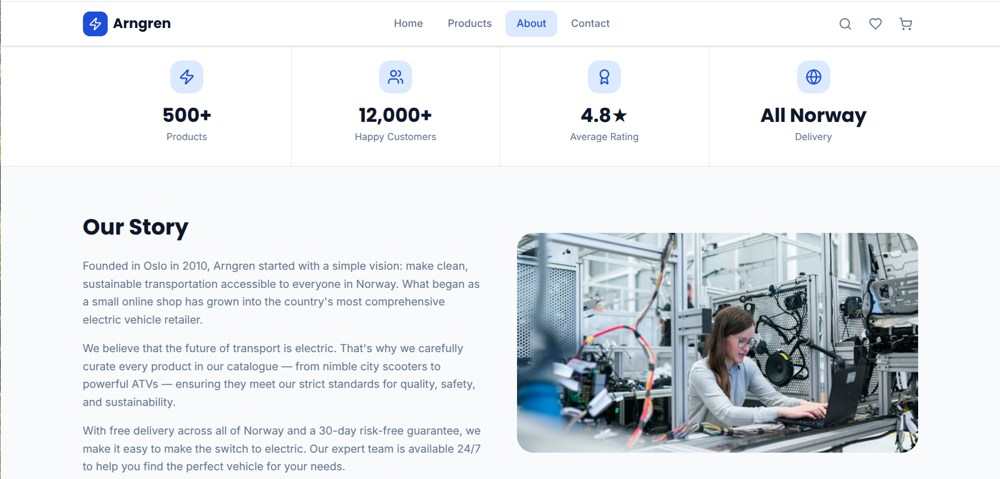
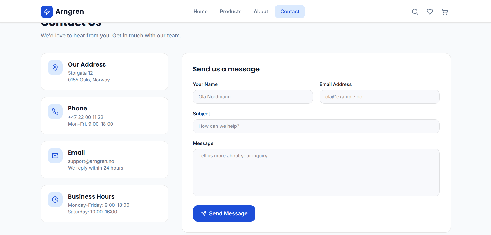

# Task 1: Website UI Redesign

## Objective

Analyze an existing website and redesign its user interface to improve clarity, structure, usability, and visual appeal.

## Website Analysis

### Issues Identified

* Cluttered and unorganized layout
* Poor navigation structure
* Inconsistent color usage
* Lack of visual hierarchy
* Limited white space, making content difficult to read

## UI/UX Principles Applied

* Visual Hierarchy
* Consistency
* Alignment
* White Space
* Accessibility
* Responsive Design

## Improvements Made

* Redesigned the navigation bar for easier access
* Applied a modern and consistent color palette
* Improved typography and readability
* Added proper spacing between sections
* Organized content using a clean layout
* Enhanced overall visual appeal and user experience

## Screenshots

### Before Redesign

### After Redesign

## Tools Used

* Figma
* GitHub

## Outcome

The redesigned interface provides a cleaner, more modern, and user-friendly experience. The changes improve usability, readability, and overall aesthetics while following standard UI/UX design principles.

